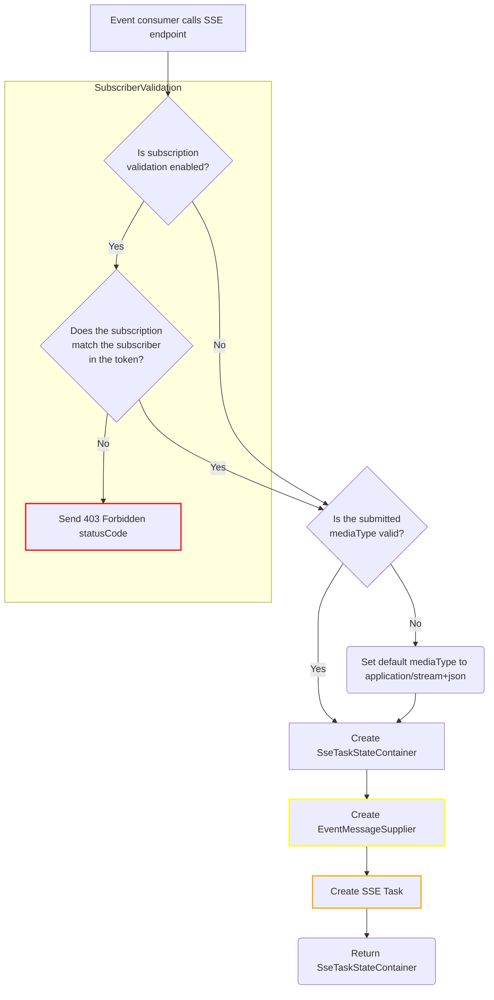
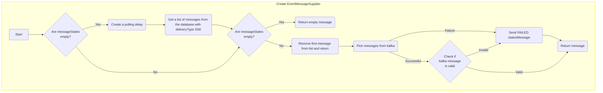
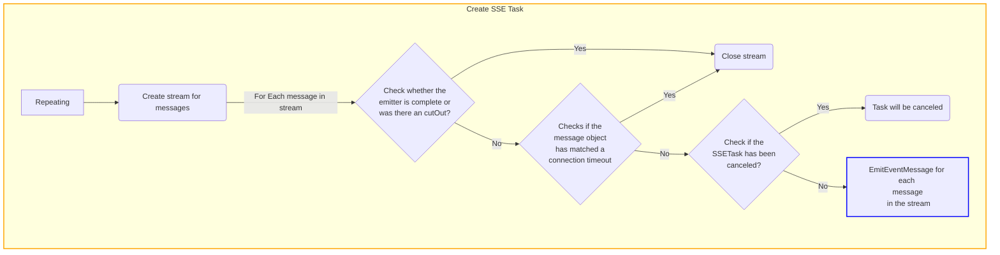
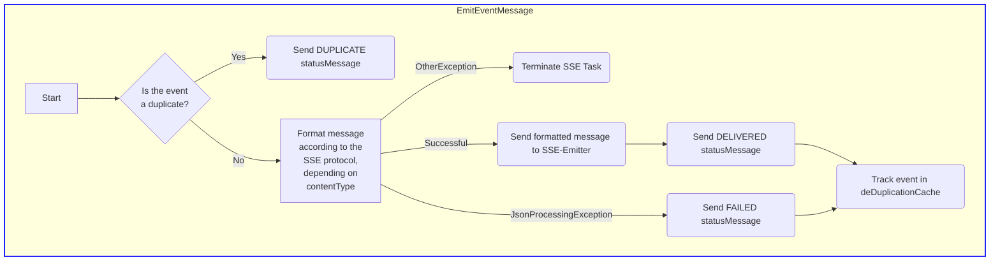

# Architecture
The main function of the Pulsar component is to facilitate the delivery of subscription-based event messages to subscribers, using Server-Sent Events (SSE) for the delivery type.
Event consumers can interact with the component by sending a GET request to the endpoint with the value /sse/{subscriptionId}. This allows event consumers to manually retrieve the events associated with their subscription.

If the component is called with an endpoint with the ending /sse/{subscriptionId}, the subscriberValidation check is initiated first, but this must be activated explicitly. 
During the subscriberValidation, the subscriberId from the token specified by the user is compared with the subscriberId from the subscription. If these subscriberIds do not match, a 403 Forbidden response is returned. 
However, if subscriberValidation is not activated, this step is skipped.

If subscriberValidation is successful or if it is not activated, Pulsar then validates the transmitted mediaType. 
If the mediaType is valid, the workflow continues and the responseContainer is created. If the mediaType is invalid, the default mediaType application/stream+json is automatically set before the responseContainer is created.
This responseContainer is returned to the customer at the end of the workflow.

Afterwards, a new instance of the EventMessageSupplier class is created. The central method of this class is get(). 
First, the pollMessageStates() method is called to retrieve messages from the database. If messages with the delivery type SSE are available, they are stored in a list. If no messages are available, an empty instance of EventMessageContext is returned.

Now the double check whether messageStates is empty is crucial. The purpose of this double check is to ensure that no other threads or processes have emptied the messageStates list between polling pollMessageStates and attempting to retrieve an item. 
This provides a form of thread-safe access to the list and contributes to the robustness and consistency of the code, especially in a multi-threaded environment. 
If it turns out that messageStates is empty, an empty EventMessageContext object is returned.

Next, each available message from the list is processed in turn. In addition to tracing and span operations, attempts are made to perform the Kafka pick operation. 
The result is then transferred to an object of type SubscriptionEventMessage for deserialization. If the Kafka Pick fails, the corresponding event is marked as FAILED, reported to Kafka and not processed further.
However, if the Kafka Pick operation is successful, the subscriptionId from the /sse/{subscriptionId} endpoint is validated against the subscriptionId from the SubscriptionEventMessage (from Kafka). If this validation fails, the corresponding event is also marked as FAILED, reported to Kafka and not processed further.

Regardless of the validation results, the output type of the class is always an EventMessageContext. In addition to the SubscriptionEventMessage (only in the positive case), this context also contains the HTTP header, span and tracing information.
The EventMessageSupplier class also contains auxiliary methods such as handleException, which is responsible for handling exceptions, and the delay method, which introduces a delay. 
The delay is applied before collecting message statuses to save resources and ensure an appropriate waiting time between retrieving messages from the database.

After the EventMessageSupplier is completed, the returned supplier is used as a parameter to create a new SseTask.
The central method of the SSETask class is run(). This method checks whether the execution of the task has been canceled. If so, the task is canceled directly. 
If this is not the case, various operations are performed, including managing of the emitter status and errors, setting status variables and creating a stream based on the EventMessageSupplier. This stream contains EventMessageContext objects that are created by applying conditions such as applyStreamEndFilter and applyConnectionTimeoutFilter. 
These conditions control when the stream ends, taking into account factors such as the termination of the emitter, timeouts and connection interruptions.

In Addition, the emitEventMessage() method is called for each event in the stream. It checks the events for duplicates, sends a DUPLICATE status message to Kafka if necessary, sends the events to the sseTaskStateContainer, updates the metadata such as the status to DELIVERED or FAILED, sends it to Kafka and handles all exceptions. 
If an event is successfully written to the DELIVERED or FAILED state, the event is added to the deduplicationCache so that it is no longer processed in the future. 
Once the entire sseTask workflow is complete, the sseTaskStateContainer is returned to the client so that it can pick up its events.

# Flowchart


## EventMessageSupplier


## SSE Task


## EmitEventMessage


## State Diagram
````mermaid
stateDiagram
    PROCESSED --> DUPLICATE: Event is duplicate
    PROCESSED --> DELIVERED: Successful delivery
    PROCESSED --> FAILED: Error with Kafka pick <br> or JSONProcessingException <br> when sending event
````